# 🦷 Dentist Tracker — Application Flows & Scenarios

This document details every user flow in the application, including normal paths, edge cases, and error handling.

---

## 1. Authentication Flows

### Flow 1.1: New Dentist Registration

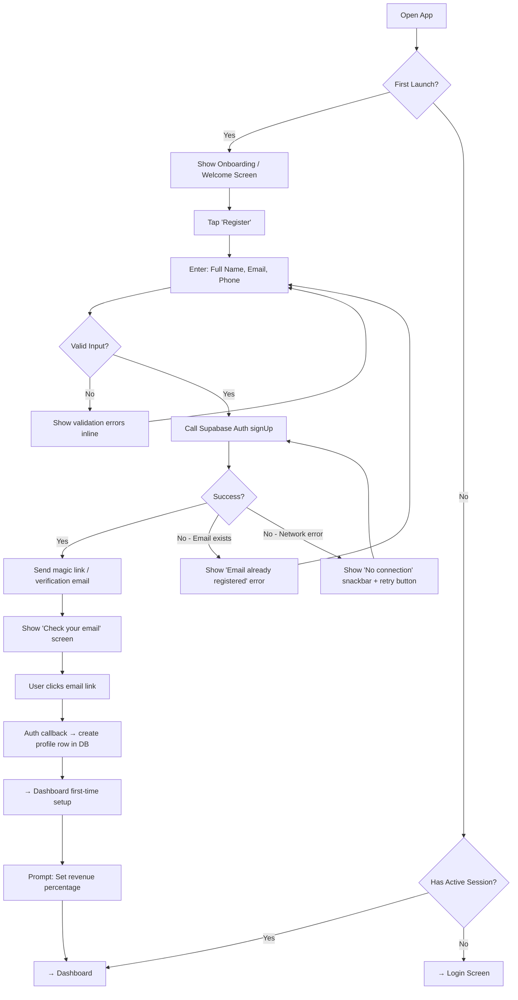
```mermaid
flowchart TD
    A[Open App] --> B{First Launch?}
    B -->|Yes| C[Show Onboarding / Welcome Screen]
    B -->|No| D{Has Active Session?}
    C --> E[Tap 'Register']
    D -->|Yes| F[→ Dashboard]
    D -->|No| G[→ Login Screen]
    E --> H[Enter: Full Name, Email, Phone]
    H --> I{Valid Input?}
    I -->|No| J[Show validation errors inline]
    J --> H
    I -->|Yes| K[Call Supabase Auth signUp]
    K --> L{Success?}
    L -->|Yes| M[Send magic link / verification email]
    M --> N[Show 'Check your email' screen]
    N --> O[User clicks email link]
    O --> P[Auth callback → create profile row in DB]
    P --> Q[→ Dashboard first-time setup]
    Q --> R[Prompt: Set revenue percentage]
    R --> F
    L -->|No - Email exists| S[Show 'Email already registered' error]
    S --> H
    L -->|No - Network error| T[Show 'No connection' snackbar + retry button]
    T --> K
```

**Scenarios:**
| Scenario | Behavior |
|----------|----------|
| Valid email, valid name | Registration succeeds → email verification sent |
| Email already registered | Error message: "This email is already registered. Try logging in." |
| Invalid email format | Inline validation: "Please enter a valid email address" |
| Empty name field | Inline validation: "Name is required" |
| No internet connection | Snackbar: "No internet connection" + retry button |
| User closes app before verifying | Next login attempt shows "Please verify your email first" |

---

### Flow 1.2: Dentist Login (Email + Magic Link)

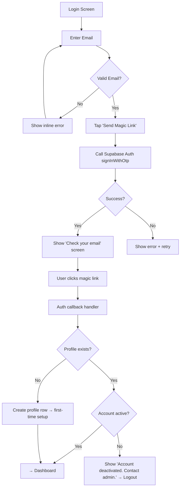
```mermaid
flowchart TD
    A[Login Screen] --> B[Enter Email]
    B --> C{Valid Email?}
    C -->|No| D[Show inline error]
    D --> B
    C -->|Yes| E[Tap 'Send Magic Link']
    E --> F[Call Supabase Auth signInWithOtp]
    F --> G{Success?}
    G -->|Yes| H[Show 'Check your email' screen]
    H --> I[User clicks magic link]
    I --> J[Auth callback handler]
    J --> K{Profile exists?}
    K -->|Yes| L{Account active?}
    K -->|No| M[Create profile row → first-time setup]
    L -->|Yes| N[→ Dashboard]
    L -->|No| O[Show 'Account deactivated. Contact admin.' → Logout]
    G -->|No| P[Show error + retry]
    M --> N
```

**Scenarios:**
| Scenario | Behavior |
|----------|----------|
| Valid email, account exists | Magic link sent → click → Dashboard |
| Valid email, no account | Magic link sent → click → auto-create profile → first-time setup |
| Account deactivated by admin | Login succeeds but profile check fails → "Account deactivated" message → forced logout |
| Magic link expired (>1 hour) | "Link expired. Please request a new one." |
| User tries to login on 2 devices | Latest magic link is valid; previous ones are invalidated |

---

### Flow 1.3: Logout

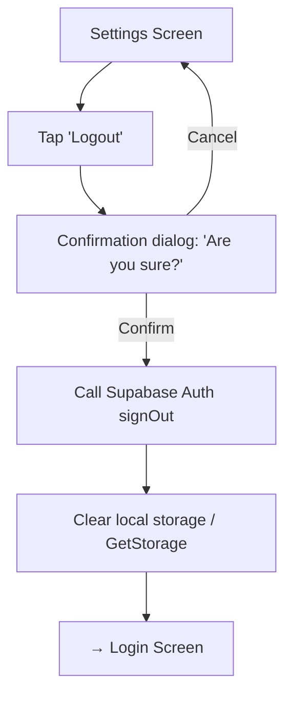
```mermaid
flowchart TD
    A[Settings Screen] --> B[Tap 'Logout']
    B --> C[Confirmation dialog: 'Are you sure?']
    C -->|Cancel| A
    C -->|Confirm| D[Call Supabase Auth signOut]
    D --> E[Clear local storage / GetStorage]
    E --> F[→ Login Screen]
```

---

## 2. Patient Management Flows

### Flow 2.1: Add New Patient

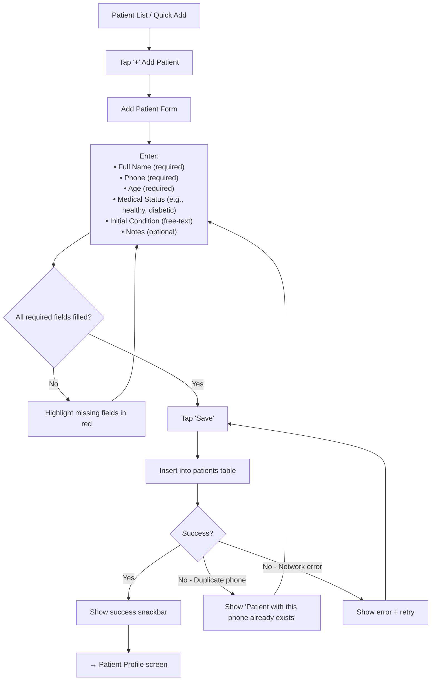
```mermaid
flowchart TD
    A[Patient List / Quick Add] --> B[Tap '+' Add Patient]
    B --> C[Add Patient Form]
    C --> D["Enter:\n• Full Name (required)\n• Phone (required)\n• Age (required)\n• Medical Status (e.g., healthy, diabetic)\n• Initial Condition (free-text)\n• Notes (optional)"]
    D --> E{All required fields filled?}
    E -->|No| F[Highlight missing fields in red]
    F --> D
    E -->|Yes| G[Tap 'Save']
    G --> H[Insert into patients table]
    H --> I{Success?}
    I -->|Yes| J[Show success snackbar]
    J --> K[→ Patient Profile screen]
    I -->|No - Duplicate phone| L["Show 'Patient with this phone already exists'"]
    L --> D
    I -->|No - Network error| M[Show error + retry]
    M --> G
```

**Scenarios:**
| Scenario | Behavior |
|----------|----------|
| All fields valid | Patient created → navigate to profile |
| Phone already exists for this dentist | Error: "A patient with this phone number already exists" |
| Name empty | Inline error: "Patient name is required" |
| Phone empty | Inline error: "Phone number is required" |
| Age = 0 or negative | Inline error: "Please enter a valid age" |
| Condition left empty | Allowed — condition can be added later |
| Medical status left empty | Allowed — defaults to "Not specified" |

---

### Flow 2.2: View Patient Profile

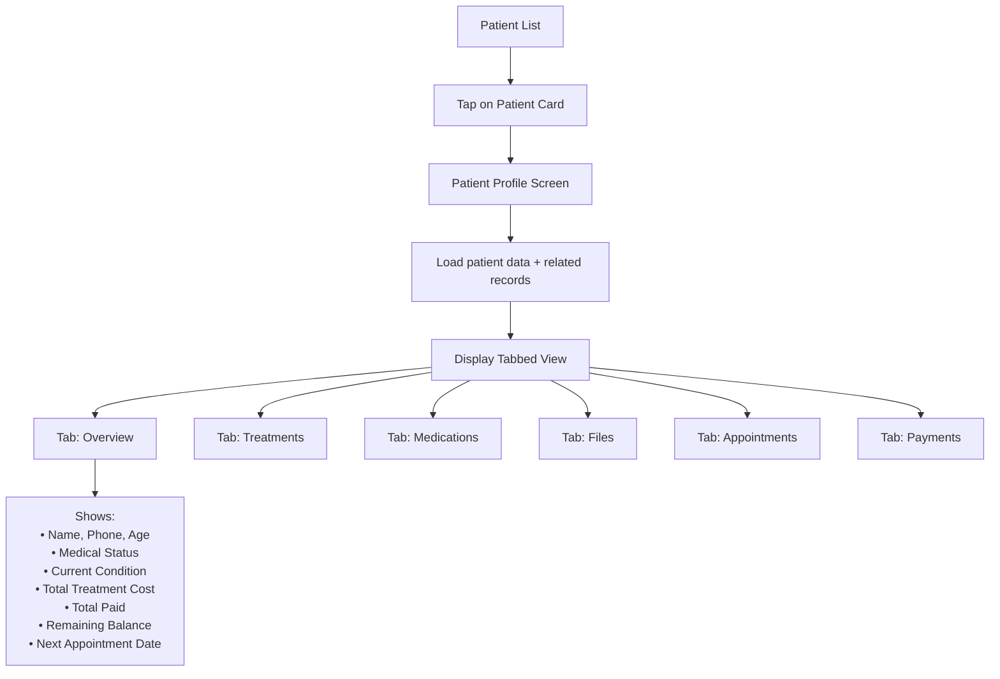
```mermaid
flowchart TD
    A[Patient List] --> B[Tap on Patient Card]
    B --> C[Patient Profile Screen]
    C --> D[Load patient data + related records]
    D --> E[Display Tabbed View]
    E --> F[Tab: Overview]
    E --> G[Tab: Treatments]
    E --> H[Tab: Medications]
    E --> I[Tab: Files]
    E --> J[Tab: Appointments]
    E --> K[Tab: Payments]
    
    F --> F1["Shows:\n• Name, Phone, Age\n• Medical Status\n• Current Condition\n• Total Treatment Cost\n• Total Paid\n• Remaining Balance\n• Next Appointment Date"]
```

**Overview Tab — Financial Summary Calculation:**
```
Total Cost       = SUM(all treatments.total_cost)
Total Paid       = SUM(all payments.amount)
Remaining        = Total Cost - Total Paid
Next Appointment = MIN(appointments.appointment_date WHERE date >= today AND status = 'scheduled')
```

---

### Flow 2.3: Edit Patient Info

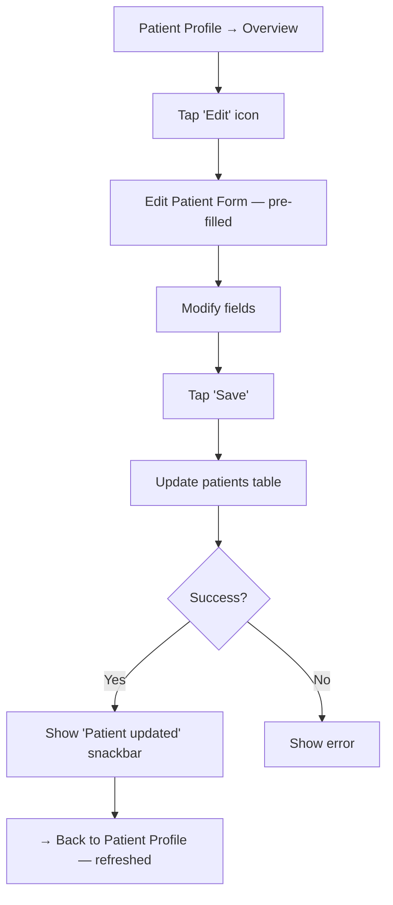
```mermaid
flowchart TD
    A[Patient Profile → Overview] --> B[Tap 'Edit' icon]
    B --> C[Edit Patient Form — pre-filled]
    C --> D[Modify fields]
    D --> E[Tap 'Save']
    E --> F[Update patients table]
    F --> G{Success?}
    G -->|Yes| H[Show 'Patient updated' snackbar]
    H --> I[→ Back to Patient Profile — refreshed]
    G -->|No| J[Show error]
```

**Key scenario — Updating Patient Condition:**
| Scenario | Behavior |
|----------|----------|
| Doctor updates condition after checkup | Condition text updated, `updated_at` timestamp refreshed |
| Doctor changes medical status | Medical status dropdown updated (e.g., "healthy" → "diabetic") |
| Doctor clears condition field | Allowed — field becomes empty |

---

### Flow 2.4: Search & Filter Patients

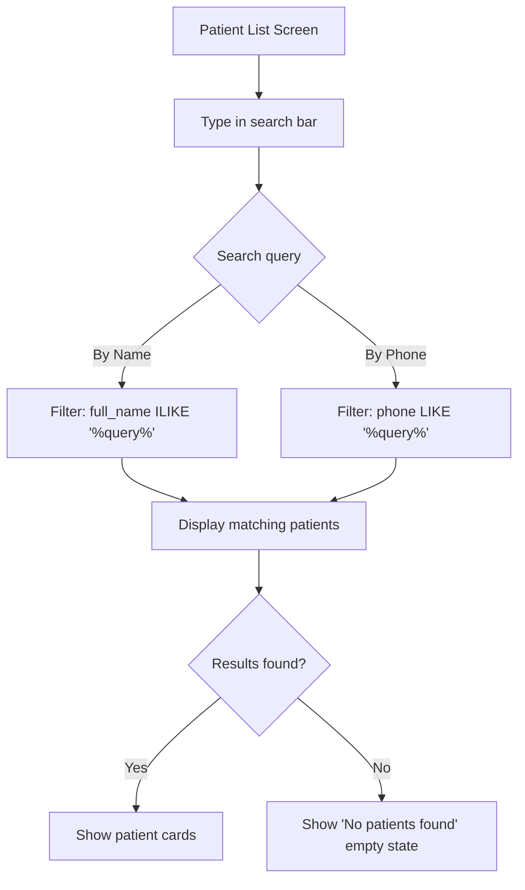
```mermaid
flowchart TD
    A[Patient List Screen] --> B[Type in search bar]
    B --> C{Search query}
    C -->|By Name| D[Filter: full_name ILIKE '%query%']
    C -->|By Phone| E[Filter: phone LIKE '%query%']
    D --> F[Display matching patients]
    E --> F
    F --> G{Results found?}
    G -->|Yes| H[Show patient cards]
    G -->|No| I[Show 'No patients found' empty state]
```

---

## 3. Treatment Flows

### Flow 3.1: Add Treatment to Patient

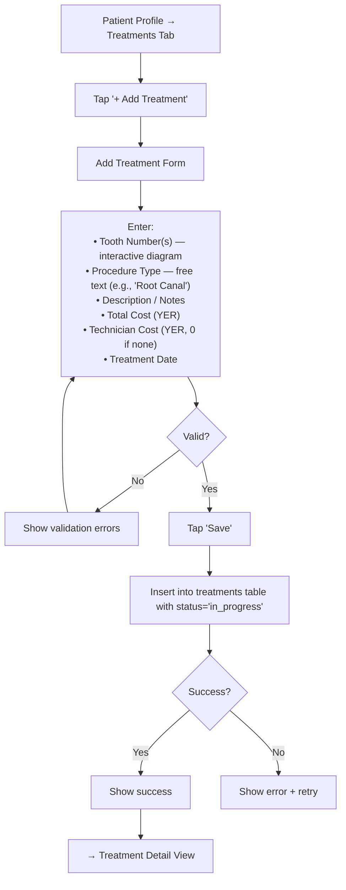
```mermaid
flowchart TD
    A[Patient Profile → Treatments Tab] --> B[Tap '+ Add Treatment']
    B --> C[Add Treatment Form]
    C --> D["Enter:\n• Tooth Number(s) — interactive diagram\n• Procedure Type — free text (e.g., 'Root Canal')\n• Description / Notes\n• Total Cost (YER)\n• Technician Cost (YER, 0 if none)\n• Treatment Date"]
    D --> E{Valid?}
    E -->|No| F[Show validation errors]
    F --> D
    E -->|Yes| G[Tap 'Save']
    G --> H[Insert into treatments table with status='in_progress']
    H --> I{Success?}
    I -->|Yes| J[Show success]
    J --> K[→ Treatment Detail View]
    I -->|No| L[Show error + retry]
```

**Tooth Selection Scenarios:**
| Scenario | Behavior |
|----------|----------|
| Single tooth (e.g., #14) | Tap tooth on diagram → highlights → stored as `[14]` |
| Multiple teeth (e.g., #14, #15, #16) | Tap multiple → all highlighted → stored as `[14, 15, 16]` |
| No tooth selected (e.g., cleaning) | Allowed — `tooth_numbers` stored as empty array `[]` |
| Deselect a tooth | Tap highlighted tooth again → unhighlighted |

**Cost Scenarios:**
| Scenario | Behavior |
|----------|----------|
| Total cost = 50,000 YER, Technician = 0 | Dentist profit pool = 50,000 YER |
| Total cost = 50,000 YER, Technician = 10,000 | Dentist profit pool = 40,000 YER |
| Technician cost > Total cost | Validation error: "Technician cost cannot exceed total cost" |
| Total cost = 0 | Allowed — for free/charity cases |

---

### Flow 3.2: View Treatment Detail

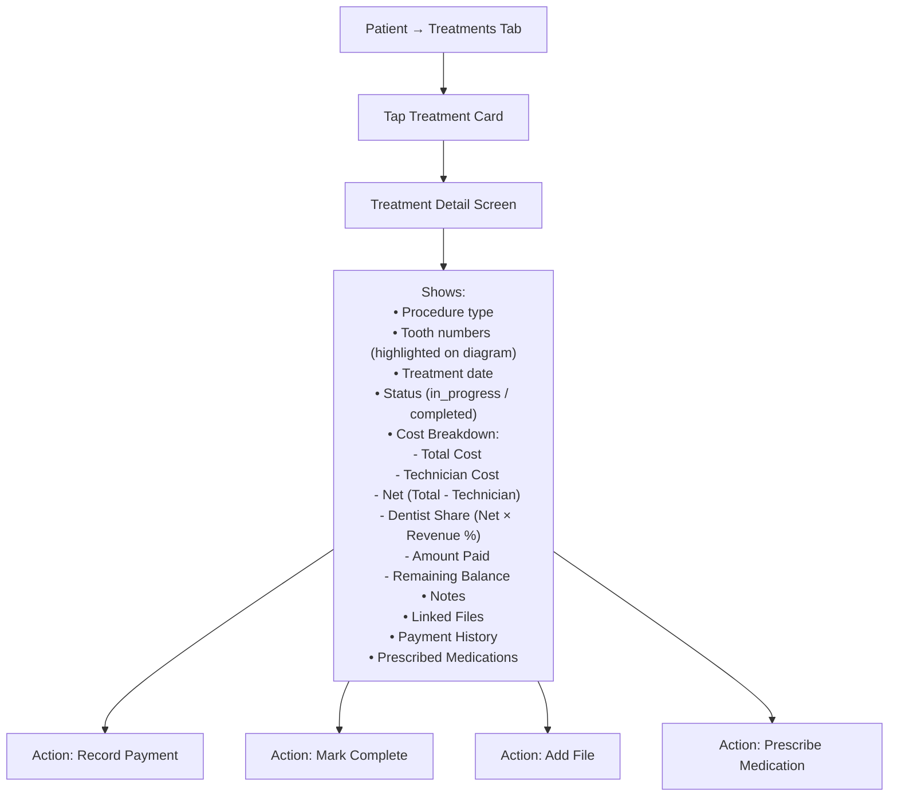
```mermaid
flowchart TD
    A[Patient → Treatments Tab] --> B[Tap Treatment Card]
    B --> C[Treatment Detail Screen]
    C --> D["Shows:\n• Procedure type\n• Tooth numbers (highlighted on diagram)\n• Treatment date\n• Status (in_progress / completed)\n• Cost Breakdown:\n  - Total Cost\n  - Technician Cost\n  - Net (Total - Technician)\n  - Dentist Share (Net × Revenue %)\n  - Amount Paid\n  - Remaining Balance\n• Notes\n• Linked Files\n• Payment History\n• Prescribed Medications"]
    
    D --> E[Action: Record Payment]
    D --> F[Action: Mark Complete]
    D --> G[Action: Add File]
    D --> H[Action: Prescribe Medication]
```

**Treatment Financial Breakdown Example:**
```
Total Cost:        50,000 YER
Technician Cost:  -10,000 YER
─────────────────────────────
Net Revenue:       40,000 YER
Dentist Share (60%): 24,000 YER

Amount Paid:       30,000 YER
Remaining:         20,000 YER  (from total, not from share)
```

---

### Flow 3.3: Update Treatment Status

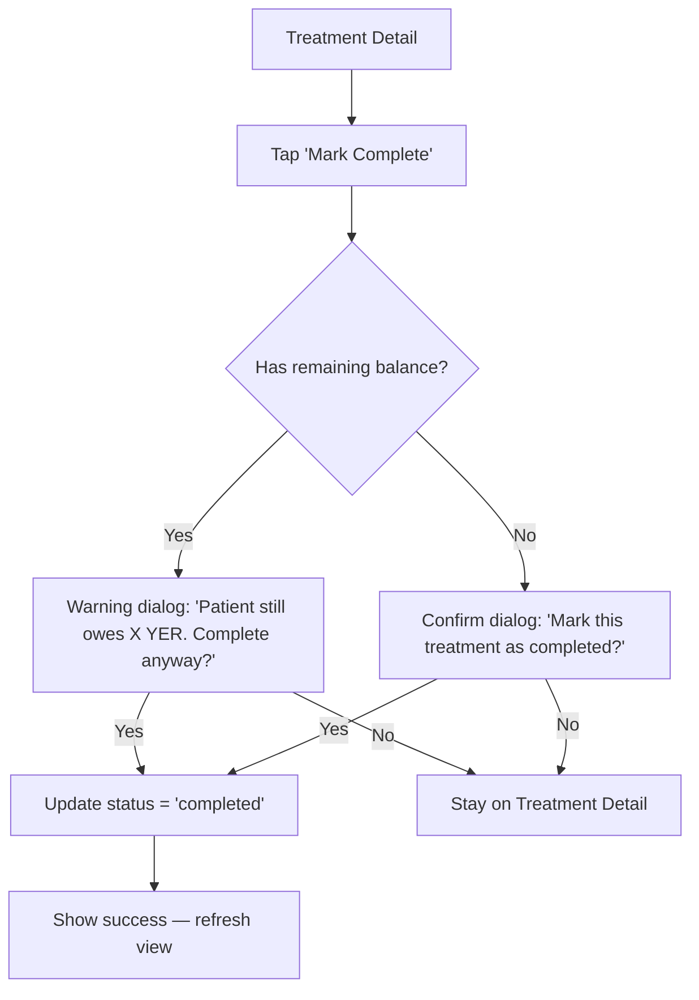
```mermaid
flowchart TD
    A[Treatment Detail] --> B[Tap 'Mark Complete']
    B --> C{Has remaining balance?}
    C -->|Yes| D[Warning dialog: 'Patient still owes X YER. Complete anyway?']
    C -->|No| E[Confirm dialog: 'Mark this treatment as completed?']
    D -->|Yes| F[Update status = 'completed']
    D -->|No| G[Stay on Treatment Detail]
    E -->|Yes| F
    E -->|No| G
    F --> H[Show success — refresh view]
```

---

## 4. Payment Flows

### Flow 4.1: Record a Payment

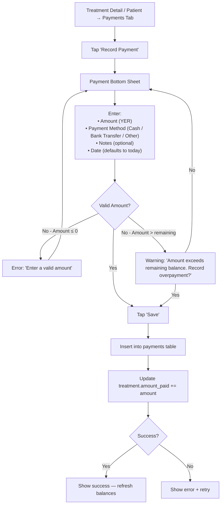
```mermaid
flowchart TD
    A["Treatment Detail / Patient → Payments Tab"] --> B[Tap 'Record Payment']
    B --> C[Payment Bottom Sheet]
    C --> D["Enter:\n• Amount (YER)\n• Payment Method (Cash / Bank Transfer / Other)\n• Notes (optional)\n• Date (defaults to today)"]
    D --> E{Valid Amount?}
    E -->|No - Amount ≤ 0| F["Error: 'Enter a valid amount'"]
    E -->|No - Amount > remaining| G[Warning: 'Amount exceeds remaining balance. Record overpayment?']
    E -->|Yes| H[Tap 'Save']
    G -->|Yes| H
    G -->|No| C
    F --> C
    H --> I[Insert into payments table]
    I --> J[Update treatment.amount_paid += amount]
    J --> K{Success?}
    K -->|Yes| L[Show success — refresh balances]
    K -->|No| M[Show error + retry]
```

**Payment Scenarios:**
| Scenario | Behavior |
|----------|----------|
| Full payment (amount = remaining) | Payment recorded, remaining becomes 0 |
| Partial payment (amount < remaining) | Payment recorded, remaining reduced |
| Overpayment (amount > remaining) | Warning shown, allowed if confirmed (dentist may have reason) |
| Zero payment | Validation error: "Amount must be greater than 0" |
| Payment on completed treatment | Allowed — patients can pay after treatment is done |
| Multiple payments on same treatment | All recorded — payment history shows full trail |

---

### Flow 4.2: View Payment History (Per Patient)

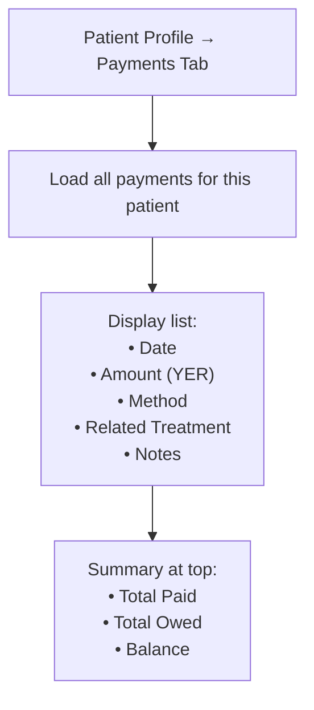
```mermaid
flowchart TD
    A[Patient Profile → Payments Tab] --> B[Load all payments for this patient]
    B --> C["Display list:\n• Date\n• Amount (YER)\n• Method\n• Related Treatment\n• Notes"]
    C --> D["Summary at top:\n• Total Paid\n• Total Owed\n• Balance"]
```

---

## 5. Medication/Prescription Flows

### Flow 5.1: Prescribe Medication

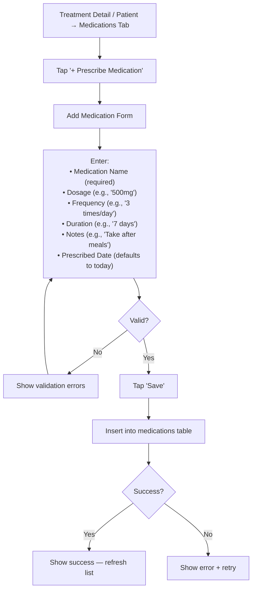
```mermaid
flowchart TD
    A["Treatment Detail / Patient → Medications Tab"] --> B[Tap '+ Prescribe Medication']
    B --> C[Add Medication Form]
    C --> D["Enter:\n• Medication Name (required)\n• Dosage (e.g., '500mg')\n• Frequency (e.g., '3 times/day')\n• Duration (e.g., '7 days')\n• Notes (e.g., 'Take after meals')\n• Prescribed Date (defaults to today)"]
    D --> E{Valid?}
    E -->|No| F[Show validation errors]
    F --> D
    E -->|Yes| G[Tap 'Save']
    G --> H[Insert into medications table]
    H --> I{Success?}
    I -->|Yes| J[Show success — refresh list]
    I -->|No| K[Show error + retry]
```

**Scenarios:**
| Scenario | Behavior |
|----------|----------|
| Medication linked to a treatment | `treatment_id` is set — medication shows under both patient medications tab AND treatment detail |
| Medication NOT linked to treatment | `treatment_id` is null — medication shows only in patient medications tab (e.g., general prescription) |
| Duplicate medication name | Allowed — same medication can be prescribed multiple times (different dates/dosages) |
| Empty dosage/frequency/duration | Allowed — only medication name is required |

---

### Flow 5.2: View Patient Medications

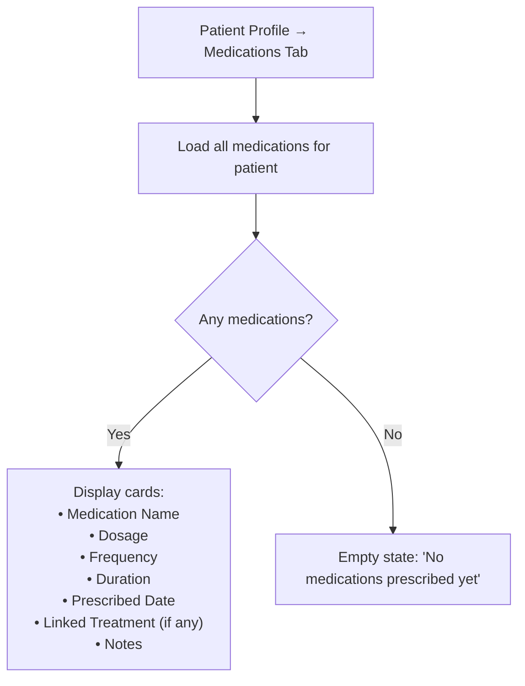
```mermaid
flowchart TD
    A[Patient Profile → Medications Tab] --> B[Load all medications for patient]
    B --> C{Any medications?}
    C -->|Yes| D["Display cards:\n• Medication Name\n• Dosage\n• Frequency\n• Duration\n• Prescribed Date\n• Linked Treatment (if any)\n• Notes"]
    C -->|No| E["Empty state: 'No medications prescribed yet'"]
```

---

## 6. Appointment Flows

### Flow 6.1: Create Appointment

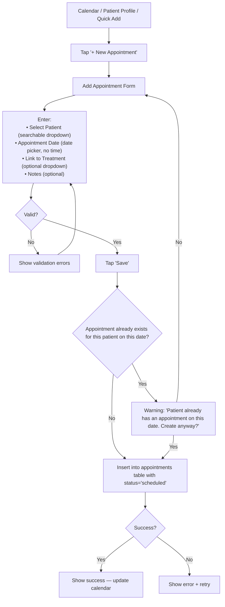
```mermaid
flowchart TD
    A["Calendar / Patient Profile / Quick Add"] --> B[Tap '+ New Appointment']
    B --> C[Add Appointment Form]
    C --> D["Enter:\n• Select Patient (searchable dropdown)\n• Appointment Date (date picker, no time)\n• Link to Treatment (optional dropdown)\n• Notes (optional)"]
    D --> E{Valid?}
    E -->|No| F[Show validation errors]
    F --> D
    E -->|Yes| G[Tap 'Save']
    G --> H{Appointment already exists for this patient on this date?}
    H -->|Yes| I["Warning: 'Patient already has an appointment on this date. Create anyway?'"]
    H -->|No| J[Insert into appointments table with status='scheduled']
    I -->|Yes| J
    I -->|No| C
    J --> K{Success?}
    K -->|Yes| L[Show success — update calendar]
    K -->|No| M[Show error + retry]
```

**Scenarios:**
| Scenario | Behavior |
|----------|----------|
| Date = today | Appointment appears in Dashboard "today's appointments" |
| Date = past | Allowed (dentist may be backfilling records) |
| Date = future | Appears on calendar with dot indicator |
| Same patient, same date | Warning shown, but allowed if confirmed |
| No treatment linked | Allowed — appointment may be for checkup/consultation |
| Created from patient profile | Patient auto-selected in form |

---

### Flow 6.2: View Daily Appointments (Dashboard)

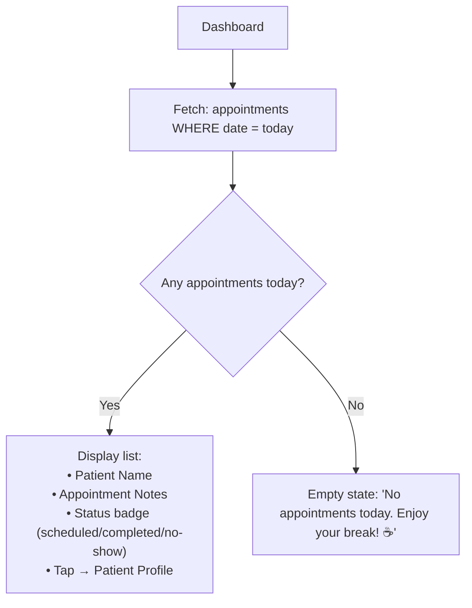
```mermaid
flowchart TD
    A[Dashboard] --> B["Fetch: appointments WHERE date = today"]
    B --> C{Any appointments today?}
    C -->|Yes| D["Display list:\n• Patient Name\n• Appointment Notes\n• Status badge (scheduled/completed/no-show)\n• Tap → Patient Profile"]
    C -->|No| E["Empty state: 'No appointments today. Enjoy your break! ☕'"]
```

---

### Flow 6.3: View Calendar (Monthly)

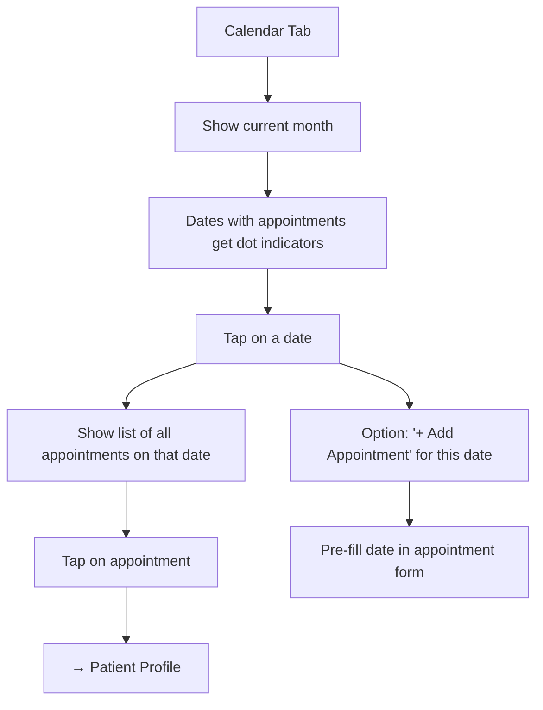
```mermaid
flowchart TD
    A[Calendar Tab] --> B[Show current month]
    B --> C[Dates with appointments get dot indicators]
    C --> D[Tap on a date]
    D --> E[Show list of all appointments on that date]
    E --> F[Tap on appointment]
    F --> G[→ Patient Profile]
    
    D --> H[Option: '+ Add Appointment' for this date]
    H --> I[Pre-fill date in appointment form]
```

---

### Flow 6.4: Update Appointment Status

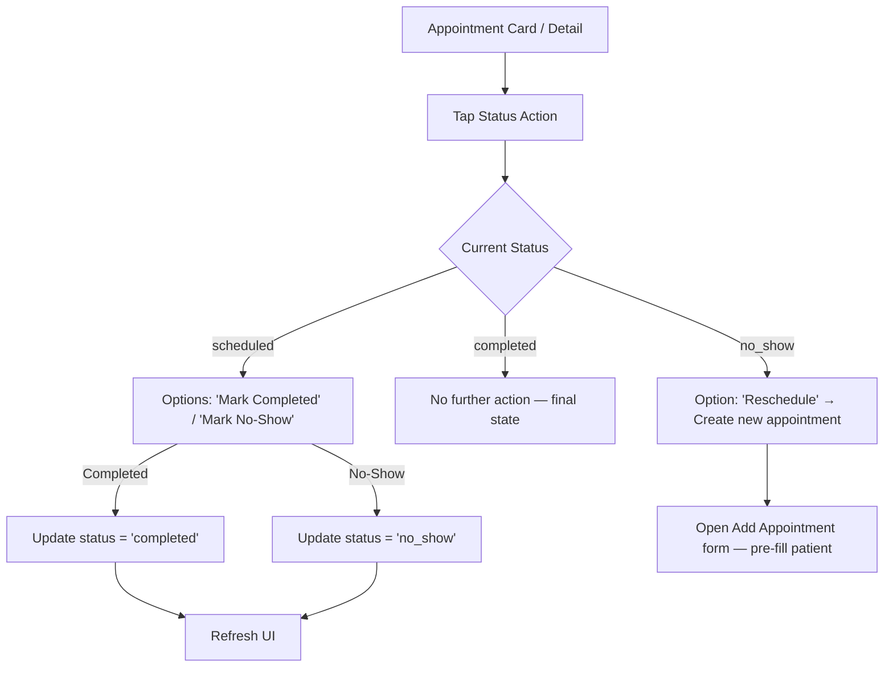
```mermaid
flowchart TD
    A[Appointment Card / Detail] --> B[Tap Status Action]
    B --> C{Current Status}
    C -->|scheduled| D[Options: 'Mark Completed' / 'Mark No-Show']
    C -->|completed| E[No further action — final state]
    C -->|no_show| F[Option: 'Reschedule' → Create new appointment]
    
    D -->|Completed| G[Update status = 'completed']
    D -->|No-Show| H[Update status = 'no_show']
    G --> I[Refresh UI]
    H --> I
    F --> J[Open Add Appointment form — pre-fill patient]
```

**Status Flow:**
```
scheduled → completed     (patient came and was treated)
scheduled → no_show       (patient didn't show up)
no_show   → reschedule    (create new appointment — old stays as no_show)
completed → (final)       (cannot be changed back)
```

---

## 7. File Management Flows

### Flow 7.1: Upload File

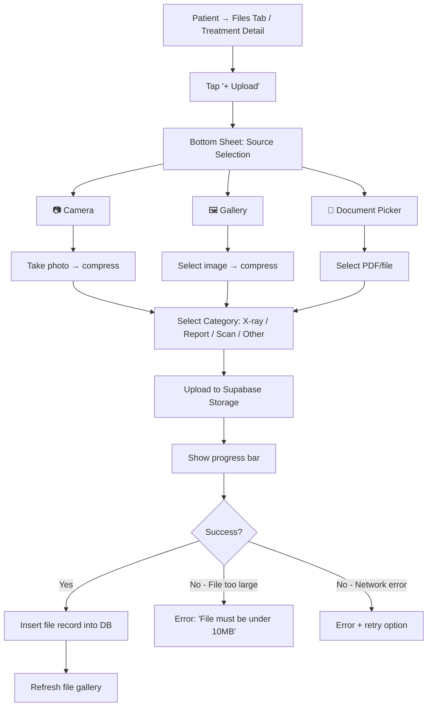
```mermaid
flowchart TD
    A["Patient → Files Tab / Treatment Detail"] --> B[Tap '+ Upload']
    B --> C[Bottom Sheet: Source Selection]
    C --> D[📷 Camera]
    C --> E[🖼️ Gallery]
    C --> F[📄 Document Picker]
    
    D --> G[Take photo → compress]
    E --> H[Select image → compress]
    F --> I[Select PDF/file]
    
    G --> J[Select Category: X-ray / Report / Scan / Other]
    H --> J
    I --> J
    
    J --> K[Upload to Supabase Storage]
    K --> L[Show progress bar]
    L --> M{Success?}
    M -->|Yes| N[Insert file record into DB]
    N --> O[Refresh file gallery]
    M -->|No - File too large| P["Error: 'File must be under 10MB'"]
    M -->|No - Network error| Q[Error + retry option]
```

**Scenarios:**
| Scenario | Behavior |
|----------|----------|
| Image file (JPG, PNG) | Compressed before upload, shown as thumbnail in gallery |
| PDF file | Shown with PDF icon, opens in built-in viewer |
| File > 10MB | Rejected with size error before upload |
| File linked to treatment | Shows in both patient files tab AND treatment detail |
| File NOT linked to treatment | Shows in patient files tab only |
| Upload interrupted | Partial upload cleaned up; user prompted to retry |

---

### Flow 7.2: View File

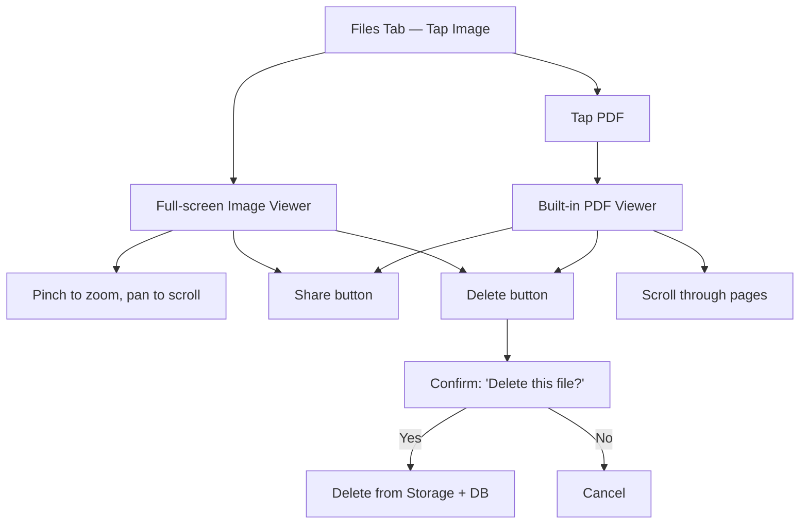
```mermaid
flowchart TD
    A[Files Tab — Tap Image] --> B[Full-screen Image Viewer]
    B --> C[Pinch to zoom, pan to scroll]
    B --> D[Share button]
    B --> E[Delete button]
    
    A --> F[Tap PDF] --> G[Built-in PDF Viewer]
    G --> H[Scroll through pages]
    G --> D
    G --> E
    
    E --> I[Confirm: 'Delete this file?']
    I -->|Yes| J[Delete from Storage + DB]
    I -->|No| K[Cancel]
```

---

## 8. Report Flows

### Flow 8.1: View Monthly Reports

```mermaid
flowchart TD
    A[Reports Tab] --> B[Default: Current Month]
    B --> C[Select date range — month/year picker]
    C --> D[Query aggregated data for selected period]
    D --> E["Display:\n1. Revenue Summary Card\n2. Revenue Bar Chart (per month)\n3. Appointments Count\n4. Outstanding Balances\n5. Completed Treatments\n6. Dentist Earnings"]
```

**Report Card Calculations:**
```
┌─────────────────────────────────────────────────┐
│ MONTHLY REPORT — April 2026                      │
├─────────────────────────────────────────────────┤
│                                                   │
│ Total Revenue:          500,000 YER               │
│   = SUM(treatments.total_cost) for the month      │
│                                                   │
│ Total Technician Costs: -80,000 YER               │
│   = SUM(treatments.technician_cost) for the month │
│                                                   │
│ Net Revenue:            420,000 YER               │
│   = Total Revenue - Technician Costs              │
│                                                   │
│ Dentist Share (60%):    252,000 YER               │
│   = Net Revenue × revenue_percentage              │
│                                                   │
│ Amount Collected:       350,000 YER               │
│   = SUM(payments.amount) for the month            │
│                                                   │
│ Outstanding Balance:    150,000 YER               │
│   = Total Revenue - Amount Collected              │
│                                                   │
│ Appointments:           45                        │
│   = COUNT(appointments) for the month             │
│                                                   │
│ Completed Treatments:   38                        │
│   = COUNT(treatments WHERE status='completed')    │
│                                                   │
│ No-Show Rate:           4/45 = 8.9%               │
│   = COUNT(appointments WHERE status='no_show')    │
│     / COUNT(all appointments)                     │
│                                                   │
└─────────────────────────────────────────────────┘
```

**Scenarios:**
| Scenario | Behavior |
|----------|----------|
| No data for selected month | Show empty state: "No activity recorded for this month" |
| Revenue % not set | Use default 100% — all net revenue counts as dentist share |
| Revenue % = 0 | Dentist share = 0 (possible edge case, warn in settings) |
| Treatment spans multiple months | Treatment counts toward the month of `treatment_date` |
| Payment made in different month than treatment | Payment counts toward the month of `payment_date` |

---

## 9. Dashboard Flow

### Flow 9.1: Dashboard Overview

```mermaid
flowchart TD
    A[App opens → Dashboard] --> B[Fetch today's data]
    B --> C["Section 1: Today's Appointments\n(list of patients scheduled for today)"]
    B --> D["Section 2: Financial Summary Cards\n• Total Income (all time)\n• Total Paid\n• Total Unpaid\n• Dentist Earnings"]
    B --> E["Section 3: Quick Actions\n• + Add Patient\n• + Add Appointment"]
    
    C --> F[Tap patient → Patient Profile]
    D --> G[Tap card → Reports with details]
    E --> H[Tap action → respective form]
```

**Dashboard Financial Cards (All-Time):**
```
Total Income    = SUM(all treatments.total_cost)
Total Paid      = SUM(all payments.amount)
Total Unpaid    = Total Income - Total Paid
Technician Costs = SUM(all treatments.technician_cost)
Dentist Earnings = (Total Income - Technician Costs) × revenue_percentage
```

---

## 10. Settings Flows

### Flow 10.1: Configure Revenue Percentage

```mermaid
flowchart TD
    A[Settings] --> B[Revenue Percentage Section]
    B --> C["Current value displayed (e.g., 60%)"]
    C --> D[Tap to edit]
    D --> E[Slider or text input: 0% — 100%]
    E --> F[Tap 'Save']
    F --> G[Update profiles.revenue_percentage]
    G --> H{Success?}
    H -->|Yes| I[Show 'Revenue percentage updated' snackbar]
    H -->|No| J[Show error]
    I --> K[All report calculations now use new percentage]
```

**Scenarios:**
| Scenario | Behavior |
|----------|----------|
| Set to 60% | Dentist gets 60% of (Total - Technician Costs) |
| Set to 100% | Dentist keeps everything after technician costs |
| Set to 0% | Warning: "Setting 0% means no dentist earnings will be calculated." Allowed if confirmed |
| Percentage applied retroactively? | **Yes** — reports recalculate using current percentage for all historical data |

---

### Flow 10.2: Switch Language

```mermaid
flowchart TD
    A[Settings → Language] --> B[Toggle: English ↔ Arabic]
    B --> C["Call Get.updateLocale()"]
    C --> D[App rebuilds with new locale]
    D --> E{Arabic selected?}
    E -->|Yes| F[RTL layout activated — all UI flips]
    E -->|No| G[LTR layout — standard]
    F --> H[Persist choice in GetStorage]
    G --> H
```

---

### Flow 10.3: Switch Theme

```mermaid
flowchart TD
    A[Settings → Theme] --> B[Toggle: Light ↔ Dark]
    B --> C["Call Get.changeTheme()"]
    C --> D[App rebuilds with new theme]
    D --> E[Persist choice in GetStorage]
```

---

## 11. Admin Panel Flows (Web)

### Flow 11.1: Admin Login

```mermaid
flowchart TD
    A[Admin Login Page] --> B[Enter admin email + password]
    B --> C[Supabase Auth signIn]
    C --> D{Success?}
    D -->|Yes| E{Check profile.is_active and is admin?}
    D -->|No| F[Show 'Invalid credentials']
    E -->|Yes — Admin| G[→ Admin Dashboard]
    E -->|No — Not admin| H[Show 'Unauthorized. Admin access required.' → Logout]
```

---

### Flow 11.2: Manage Dentist Users

```mermaid
flowchart TD
    A[Admin Dashboard → Users] --> B[Data Table: All Dentists]
    B --> C["Columns:\n• Name\n• Email\n• Phone\n• Patients Count\n• Revenue (Total)\n• Status (Active/Inactive)\n• Registered Date"]
    
    C --> D[Search bar — filter by name/email]
    C --> E[Click column header — sort]
    C --> F[Click row → User Detail]
    
    F --> G["User Detail:\n• Profile info\n• Total patients\n• Total revenue\n• Total appointments\n• Last activity date"]
    
    F --> H[Toggle Active/Inactive]
    H --> I{Currently active?}
    I -->|Yes| J[Deactivate → user can't login on mobile]
    I -->|No| K[Activate → user can login again]
```

---

### Flow 11.3: System Analytics

```mermaid
flowchart TD
    A[Admin Dashboard → Analytics] --> B["Display:\n• Total Registered Dentists\n• Active Dentists (last 30 days)\n• Total Patients (all dentists)\n• Total Revenue (platform-wide)\n• Growth charts: users over time\n• Top dentists by patient count"]
```

---

## 12. Cross-Cutting Concerns

### 12.1: Network Error Handling

| Situation | Behavior |
|-----------|----------|
| No internet on app open | Show cached data (if available) + "Offline mode" banner |
| No internet during save | Show error snackbar + "Retry" button, do NOT navigate away |
| Connection restored | Auto-refresh current screen data |
| Supabase service down | Show "Service temporarily unavailable. Please try again later." |

### 12.2: Data Validation Summary

| Field | Rule |
|-------|------|
| Patient name | Required, min 2 characters |
| Patient phone | Required, numeric, min 9 digits |
| Patient age | Required, integer, 0–120 |
| Treatment total cost | Required, numeric, ≥ 0 |
| Treatment technician cost | Numeric, ≥ 0, ≤ total cost |
| Payment amount | Required, numeric, > 0 |
| Medication name | Required, min 2 characters |
| Appointment date | Required, valid date |
| Revenue percentage | 0–100, numeric |

### 12.3: Data Deletion Policy

| Entity | Deletable? | Behavior |
|--------|-----------|----------|
| Patient | Yes (soft) | Sets `is_deleted` flag, hidden from UI, retains data for reports |
| Treatment | No | Treatments are permanent financial records |
| Payment | No | Payments are permanent financial records |
| Appointment | Yes | Can be deleted if status = 'scheduled' |
| File | Yes | Deletes from Storage + DB record |
| Medication | Yes | Can be deleted by the dentist |

### 12.4: Concurrent Session Handling

| Scenario | Behavior |
|----------|----------|
| Same account on 2 phones | Both sessions active — data syncs via Supabase real-time |
| Session expired | Auto-redirect to login on next API call |
| Password/email changed via admin | All active sessions invalidated → forced re-login |
