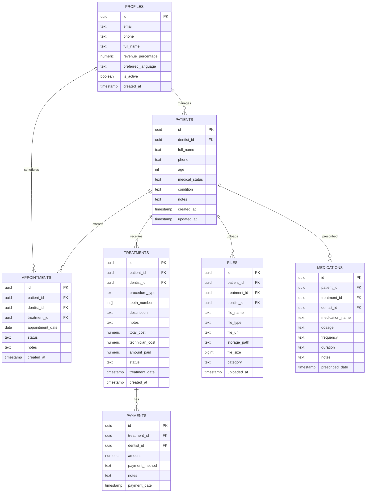

# 🦷 Dentist Tracker — Full Implementation Plan (v2)

> **Architecture**: Flutter Mobile App (dentist) + Next.js Web Admin Panel + Supabase Backend

---

## System Architecture

```mermaid
flowchart TB
    subgraph Mobile["📱 Flutter Mobile App (Dentist)"]
        A[GetX State Management]
        B[Patient Management]
        C[Appointments & Calendar]
        D[Treatments & Payments]
        E[Reports & Dashboard]
        F[File Uploads]
        G[AR / EN + RTL]
    end
    
    subgraph Admin["🖥️ Next.js Admin Panel (Web)"]
        H[User Management]
        I[System Analytics]
        J[Subscription Control]
        K[Support & Monitoring]
    end
    
    subgraph Backend["☁️ Supabase Backend"]
        L[(PostgreSQL DB)]
        M[Auth Service]
        N[Storage Buckets]
        O[Row Level Security]
        P[Edge Functions]
    end
    
    Mobile -->|supabase_flutter| Backend
    Admin -->|@supabase/ssr| Backend
```

---

## Tech Stack

### 📱 Mobile App (Dentist-Facing)
| Layer | Choice | Rationale |
|-------|--------|-----------|
| **Framework** | Flutter 3.x | Cross-platform (Android + iOS) from single codebase |
| **State Management** | GetX | Reactive state, dependency injection, routing, i18n — all-in-one |
| **Language** | Dart | Flutter's native language |
| **Backend Client** | `supabase_flutter` | Official Supabase SDK for Flutter |
| **Local Storage** | `get_storage` | Lightweight, GetX-compatible persistent storage |
| **Charts** | `fl_chart` | Beautiful, animated charts for Flutter |
| **Image Picker** | `image_picker` + `file_picker` | Camera, gallery, and document uploads |
| **PDF Viewer** | `syncfusion_flutter_pdfviewer` (free community) | In-app PDF viewing for reports/X-rays |
| **Date Picker** | `table_calendar` | Full-featured calendar widget |
| **Image Cache** | `cached_network_image` | Efficient image loading with caching |
| **Fonts** | Google Fonts (`google_fonts`) | Inter + Noto Sans Arabic |

### 🖥️ Admin Panel (Web)
| Layer | Choice | Rationale |
|-------|--------|-----------|
| **Framework** | Next.js 15 (App Router) | SSR, API routes, Vercel deployment |
| **Language** | TypeScript | Type safety |
| **Styling** | Vanilla CSS + CSS custom properties | Full control, premium design |
| **Auth** | `@supabase/ssr` | Secure server-side session management |
| **Tables** | Custom data tables | Sortable, filterable user management |
| **Charts** | Recharts | System analytics visualization |

### ☁️ Backend (Shared)
| Layer | Choice | Rationale |
|-------|--------|-----------|
| **BaaS** | Supabase (Free Tier) | Auth, Postgres, Storage, RLS — all-in-one |
| **Database** | PostgreSQL (via Supabase) | Relational, ACID, perfect for financial data |
| **File Storage** | Supabase Storage (1 GB free) | X-rays, PDFs, scans per patient |
| **Authentication** | Supabase Auth | Email + Magic Link (free); Phone OTP optional |
| **Hosting (Admin)** | Vercel or Cloudflare Pages | Zero-config Next.js deployment |
| **Email** | Supabase built-in / Resend free tier | Auth emails, password resets |

### 💰 Cost Analysis

| Service | Free Tier Limits | Monthly Cost |
|---------|-----------------|-------------|
| Supabase | 500 MB DB, 1 GB storage, 50K MAU | **$0** |
| Vercel (admin panel) | 100 GB bandwidth | **$0** (Hobby) |
| Resend (email) | 3,000 emails/month | **$0** |
| Play Store (one-time) | — | **$25 once** |
| Apple App Store (annual) | — | **$99/year** |
| **Total recurring** | | **$0/month** |

> [!NOTE]
> The mobile app connects directly to Supabase — no custom backend server needed. This keeps operational costs at absolute zero.

---

## User Review Required

> [!IMPORTANT]
> **1. Phone Authentication**: Should we include phone OTP in v1 (requires Twilio ~$0.05/SMS), or start with email/magic link only (free)?

> [!IMPORTANT]
> **2. Target Platforms**: Android only, iOS only, or both? This affects app store costs and testing.

> [!IMPORTANT]
> **3. Multi-Dentist Support**: Should multiple dentists share one clinic account (each with their own revenue %), or is this strictly single-dentist?

> [!NOTE]
> **Currency**: Hardcoded to Yemeni Rial (YER) — no configuration needed.

---

## Database Schema



### Key Design Decisions
- **`profiles`** — lean table extending `auth.users`: name, revenue %, language only. Currency hardcoded to YER
- **`patients`** — simplified: name, phone, age, medical status, initial condition (editable). No email/DOB/gender
- **`condition`** — free-text field recorded at patient creation, updated by dentist over time
- **`medical_status`** — tracks patient's general health status (e.g., diabetic, healthy, hypertension)
- **`appointments`** — date-based only (`appointment_date`), no time slots
- **`medications`** — tracks prescriptions with dosage, frequency, and duration per patient/treatment
- **Treatments** are the financial core — each has total cost, technician cost, and running payment total
- **Payments** separated from treatments for installment/partial payment support
- **Tooth numbers** as PostgreSQL integer arrays for multi-tooth procedures
- **No pre-configured procedures** — dentist types procedure name freely per treatment
- **RLS** on every table — each dentist sees only their own data; admin sees all

---

## 📱 Flutter Mobile App — Project Structure

```
lib/
├── main.dart                           # App entry point
├── app/
│   ├── core/
│   │   ├── theme/
│   │   │   ├── app_theme.dart          # Light & dark theme definitions
│   │   │   ├── app_colors.dart         # Color palette constants
│   │   │   └── app_text_styles.dart    # Typography system
│   │   ├── constants/
│   │   │   ├── app_constants.dart      # App-wide constants
│   │   │   └── supabase_constants.dart # Table names, bucket names
│   │   ├── utils/
│   │   │   ├── formatters.dart         # Currency, date, number formatters
│   │   │   ├── validators.dart         # Form validation helpers
│   │   │   └── helpers.dart            # Misc utilities
│   │   └── widgets/
│   │       ├── app_button.dart         # Reusable button component
│   │       ├── app_text_field.dart     # Styled text input
│   │       ├── app_card.dart           # Glassmorphism card
│   │       ├── loading_overlay.dart    # Loading indicator
│   │       ├── empty_state.dart        # Empty list placeholder
│   │       └── tooth_diagram.dart      # Interactive dental chart widget
│   │
│   ├── data/
│   │   ├── models/
│   │   │   ├── patient_model.dart
│   │   │   ├── medication_model.dart
│   │   │   ├── treatment_model.dart
│   │   │   ├── payment_model.dart
│   │   │   ├── appointment_model.dart
│   │   │   ├── file_model.dart
│   │   │   └── profile_model.dart
│   │   ├── providers/
│   │   │   ├── supabase_provider.dart  # Raw Supabase queries
│   │   │   └── storage_provider.dart   # File upload/download
│   │   └── repositories/
│   │       ├── auth_repository.dart
│   │       ├── patient_repository.dart
│   │       ├── treatment_repository.dart
│   │       ├── payment_repository.dart
│   │       ├── appointment_repository.dart
│   │       ├── medication_repository.dart
│   │       └── file_repository.dart
│   │
│   ├── modules/
│   │   ├── auth/
│   │   │   ├── bindings/auth_binding.dart
│   │   │   ├── controllers/auth_controller.dart
│   │   │   └── views/
│   │   │       ├── login_view.dart
│   │   │       ├── register_view.dart
│   │   │       └── widgets/
│   │   │
│   │   ├── dashboard/
│   │   │   ├── bindings/dashboard_binding.dart
│   │   │   ├── controllers/dashboard_controller.dart
│   │   │   └── views/
│   │   │       ├── dashboard_view.dart
│   │   │       └── widgets/
│   │   │           ├── daily_schedule_card.dart
│   │   │           ├── financial_summary_card.dart
│   │   │           └── upcoming_appointments.dart
│   │   │
│   │   ├── patients/
│   │   │   ├── bindings/patient_binding.dart
│   │   │   ├── controllers/
│   │   │   │   ├── patient_list_controller.dart
│   │   │   │   └── patient_detail_controller.dart
│   │   │   └── views/
│   │   │       ├── patient_list_view.dart
│   │   │       ├── patient_detail_view.dart
│   │   │       ├── add_patient_view.dart
│   │   │       └── widgets/
│   │   │           ├── patient_card.dart
│   │   │           ├── patient_search_bar.dart
│   │   │           └── patient_info_tab.dart
│   │   │
│   │   ├── treatments/
│   │   │   ├── bindings/treatment_binding.dart
│   │   │   ├── controllers/treatment_controller.dart
│   │   │   └── views/
│   │   │       ├── add_treatment_view.dart
│   │   │       ├── treatment_detail_view.dart
│   │   │       └── widgets/
│   │   │           ├── tooth_selector.dart
│   │   │           └── cost_breakdown.dart
│   │   │
│   │   ├── payments/
│   │   │   ├── bindings/payment_binding.dart
│   │   │   ├── controllers/payment_controller.dart
│   │   │   └── views/
│   │   │       ├── record_payment_view.dart
│   │   │       └── payment_history_view.dart
│   │   │
│   │   ├── medications/
│   │   │   ├── bindings/medication_binding.dart
│   │   │   ├── controllers/medication_controller.dart
│   │   │   └── views/
│   │   │       ├── add_medication_view.dart
│   │   │       ├── medication_list_view.dart
│   │   │       └── widgets/
│   │   │           └── medication_card.dart
│   │   │
│   │   ├── appointments/
│   │   │   ├── bindings/appointment_binding.dart
│   │   │   ├── controllers/appointment_controller.dart
│   │   │   └── views/
│   │   │       ├── calendar_view.dart
│   │   │       ├── day_appointments_view.dart
│   │   │       ├── add_appointment_view.dart
│   │   │       └── widgets/
│   │   │           ├── calendar_widget.dart
│   │   │           └── appointment_tile.dart
│   │   │
│   │   ├── reports/
│   │   │   ├── bindings/report_binding.dart
│   │   │   ├── controllers/report_controller.dart
│   │   │   └── views/
│   │   │       ├── reports_view.dart
│   │   │       └── widgets/
│   │   │           ├── revenue_chart.dart
│   │   │           ├── appointments_chart.dart
│   │   │           └── outstanding_balances.dart
│   │   │
│   │   ├── files/
│   │   │   ├── bindings/file_binding.dart
│   │   │   ├── controllers/file_controller.dart
│   │   │   └── views/
│   │   │       ├── file_gallery_view.dart
│   │   │       └── widgets/
│   │   │           ├── file_upload_sheet.dart
│   │   │           └── image_viewer.dart
│   │   │
│   │   └── settings/
│   │       ├── bindings/settings_binding.dart
│   │       ├── controllers/settings_controller.dart
│   │       └── views/
│   │           ├── settings_view.dart
│   │           └── widgets/
│   │               ├── revenue_config.dart
│   │               ├── language_switcher.dart
│   │               └── theme_switcher.dart
│   │
│   ├── routes/
│   │   ├── app_pages.dart              # GetPage route definitions
│   │   └── app_routes.dart             # Route name constants
│   │
│   └── translations/
│       ├── app_translations.dart       # GetX Translations class
│       ├── en_us.dart                  # English strings
│       └── ar_sa.dart                  # Arabic strings
│
├── assets/
│   ├── images/                         # App images, onboarding illustrations
│   ├── icons/                          # Custom SVG icons
│   └── fonts/                          # Bundled fonts (fallback)
```

---

## 🖥️ Admin Panel — Project Structure

```
admin/
├── src/
│   └── app/
│       ├── layout.tsx                  # Root layout
│       ├── page.tsx                    # Login redirect
│       ├── auth/
│       │   └── login/page.tsx          # Admin login
│       ├── dashboard/
│       │   ├── layout.tsx              # Admin shell (sidebar + header)
│       │   ├── page.tsx                # Overview stats
│       │   ├── users/
│       │   │   ├── page.tsx            # All dentist accounts list
│       │   │   └── [id]/page.tsx       # Individual user detail
│       │   ├── analytics/
│       │   │   └── page.tsx            # System-wide analytics
│       │   └── settings/
│       │       └── page.tsx            # Admin settings
├── styles/
│   └── globals.css                     # Design system
├── lib/
│   ├── supabase/
│   │   ├── client.ts                   # Browser client
│   │   ├── server.ts                   # Server client (service role)
│   │   └── middleware.ts               # Auth middleware
│   └── types/                          # TypeScript types
└── middleware.ts                       # Route protection
```

### Admin Panel Features
| Feature | Description |
|---------|-------------|
| **User List** | View all registered dentists, search, filter, sort |
| **User Detail** | View dentist profile, activity, patient count, revenue |
| **Activate/Deactivate** | Toggle `is_active` on dentist accounts |
| **System Analytics** | Total users, total patients, platform revenue, growth charts |
| **Role Management** | Assign/revoke admin roles |

---

## 📱 Mobile App UI/UX Design

### Visual Identity
- **Primary**: Deep teal gradient (`#0D9488` → `#0F766E`) — professional, medical
- **Accent**: Warm gold (`#F59E0B`) — CTAs, highlights, balance indicators
- **Success/Paid**: Emerald (`#10B981`)
- **Warning/Partial**: Amber (`#F59E0B`)
- **Danger/Unpaid**: Rose (`#F43F5E`)
- **Dark mode base**: Deep navy (`#0F172A`) with glassmorphism cards
- **Light mode base**: Clean whites (`#FAFAFA`) with subtle gray cards
- **Typography**: Inter (Latin) + Noto Sans Arabic (Arabic)
- **Border radius**: 16px cards, 12px buttons — smooth modern feel
- **Animations**: Smooth page transitions, card press effects, chart animations

### Key Mobile Screens

| Screen | Description |
|--------|-------------|
| **Login/Register** | Clean form with gradient background, logo animation |
| **Dashboard** | Today's appointments list + financial summary cards + quick actions |
| **Patient List** | Searchable list with avatar, name, next appointment, balance badge |
| **Patient Profile** | Tabbed view: Overview · Treatments · Medications · Files · Appointments · Payments |
| **Add Patient** | Name, phone, age, medical status, initial condition |
| **Add Treatment** | Interactive tooth diagram + free-text procedure + cost fields |
| **Add Medication** | Medication name, dosage, frequency, duration, notes |
| **Calendar** | Monthly calendar with appointment dots → day view with patient list |
| **Reports** | Animated charts — revenue, appointments, balances, dentist share |
| **Settings** | Revenue %, language toggle, theme toggle, profile edit |

### Navigation
- **Bottom Navigation Bar** with 5 tabs:
  1. 🏠 Dashboard
  2. 👥 Patients
  3. ➕ Quick Add (FAB-style)
  4. 📅 Calendar
  5. 📊 Reports
- Settings accessible from Dashboard app bar

---

## Proposed Changes

### Part A: Supabase Backend Setup

#### [NEW] Database migrations & configuration
- Create Supabase project
- Write SQL migrations for all 7 tables (profiles, patients, treatments, payments, appointments, files, medications)
- Configure RLS policies (dentist-scoped + admin-scoped)
- Create storage buckets (`patient-files`) with RLS
- Set up auth providers (email + magic link)
- Create database functions for financial calculations

---

### Part B: Flutter Mobile App

#### Phase 1: Project Foundation
- Initialize Flutter project
- Configure GetX, Supabase, and all dependencies
- Set up app theme (colors, typography, dark/light mode)
- Create reusable UI components (buttons, cards, text fields, etc.)
- Set up GetX routing with `AppPages` and `AppRoutes`
- Set up GetX translations (EN + AR) with RTL support
- Create data models for all entities (including MedicationModel)
- Create Supabase provider and repository layers

#### Phase 2: Authentication
- Build login screen (email / magic link)
- Build registration screen (name, email)
- Implement `AuthController` with session management
- Implement auth state listener (auto-login, logout)
- Create auth middleware for route protection

#### Phase 3: Dashboard
- Build dashboard view with today's appointments (date-based)
- Build financial summary cards (total income, paid, unpaid, dentist share)
- Build quick action buttons (add patient, add appointment)
- Implement `DashboardController` with real-time data

#### Phase 4: Patient Management
- Build patient list with search and sort
- Build add/edit patient form (name, phone, age, medical status, condition)
- Build patient detail view with tabbed layout
- Build patient overview tab (info + condition + balance summary)
- Build treatments tab with treatment cards
- Build medications tab with prescription list
- Build files tab with image/PDF viewer
- Build appointments tab
- Build payments tab with history

#### Phase 5: Treatments, Payments & Medications
- Build interactive tooth diagram (SVG-based)
- Build add treatment form (tooth selection + free-text procedure + costs + notes)
- Build treatment detail view
- Build record payment bottom sheet
- Build add medication form (name, dosage, frequency, duration)
- Build medication list view per patient
- Implement technician cost deduction logic
- Implement dentist revenue percentage calculation

#### Phase 6: Appointments & Calendar
- Build monthly calendar view with appointment indicators
- Build day appointments view — list of patients for selected date
- Build add/edit appointment form (select patient + date + notes)
- Implement appointment status management
- Build appointment reminders (local notifications)

#### Phase 7: Reports
- Build monthly report view
- Build revenue bar chart (fl_chart)
- Build appointment count chart
- Build outstanding balances list
- Build completed treatments breakdown
- Build dentist earnings summary with percentage
- Implement date range filtering

#### Phase 8: Settings & Polish
- Build settings page (profile, revenue %, language, theme)
- Build language switcher with GetX locale update
- Build dark/light theme toggle with persistence
- Implement YER currency formatting per locale
- Mobile-first responsive refinements

---

### Part C: Admin Panel (Web)

#### Phase 9: Admin Foundation
- Initialize Next.js 15 project
- Configure Supabase SSR client with service role
- Create CSS design system (dark theme admin aesthetic)
- Build admin login page
- Build admin layout shell (sidebar + header)

#### Phase 10: User Management
- Build dentist user list with search/filter/sort
- Build user detail page (profile, stats, activity)
- Implement activate/deactivate user functionality
- Build system analytics dashboard (total users, revenue overview)
- Build role management (promote to admin)

---

## Full Task Breakdown

### 🗄️ Backend Setup (Tasks 1–7)
| # | Task | Effort |
|---|------|--------|
| 1 | Create Supabase project, configure env variables | 10 min |
| 2 | Write SQL migration: `profiles` table + trigger from `auth.users` | 15 min |
| 3 | Write SQL migration: `patients`, `treatments`, `payments` tables | 20 min |
| 4 | Write SQL migration: `appointments`, `files`, `medications` tables | 15 min |
| 5 | Write RLS policies for all tables (dentist-scoped + admin-scoped) | 25 min |
| 6 | Create storage bucket `patient-files` with RLS policies | 10 min |
| 7 | Create DB functions: revenue calculation, financial summaries | 15 min |

### 📱 Mobile — Foundation (Tasks 8–18)
| # | Task | Effort |
|---|------|--------|
| 8 | Initialize Flutter project, add all dependencies to `pubspec.yaml` | 15 min |
| 9 | Create `app_colors.dart`, `app_theme.dart` (light + dark), `app_text_styles.dart` | 30 min |
| 10 | Create reusable `AppButton` widget (primary, secondary, outline variants) | 15 min |
| 11 | Create reusable `AppTextField` widget with validation support | 15 min |
| 12 | Create reusable `AppCard` widget with glassmorphism styling | 15 min |
| 13 | Create `LoadingOverlay`, `EmptyState`, and `ErrorState` widgets | 15 min |
| 14 | Set up GetX routing — `app_routes.dart` + `app_pages.dart` | 15 min |
| 15 | Set up GetX translations — `en_us.dart` + `ar_sa.dart` skeleton | 20 min |
| 16 | Create all data models (`PatientModel`, `TreatmentModel`, `MedicationModel`, etc.) | 25 min |
| 17 | Create `SupabaseProvider` with CRUD methods for all tables | 30 min |
| 18 | Create repository layer wrapping provider with error handling | 25 min |

### 📱 Mobile — Auth (Tasks 19–23)
| # | Task | Effort |
|---|------|--------|
| 19 | Build login screen UI — email field, magic link button, gradient bg | 30 min |
| 20 | Build register screen UI — name, email, phone, submit | 25 min |
| 21 | Implement `AuthController` — login, register, logout, session listener | 30 min |
| 22 | Create `AuthBinding` with dependency injection | 10 min |
| 23 | Implement auth middleware — redirect to login if unauthenticated | 15 min |

### 📱 Mobile — Dashboard (Tasks 24–28)
| # | Task | Effort |
|---|------|--------|
| 24 | Build dashboard view layout with scroll + app bar | 20 min |
| 25 | Build today's appointments section — list of patients for today | 30 min |
| 26 | Build financial summary cards — income, paid, unpaid, earnings | 25 min |
| 27 | Build quick action row — add patient, add appointment buttons | 10 min |
| 28 | Implement `DashboardController` — fetch today's data, financials | 25 min |

### 📱 Mobile — Patients (Tasks 29–38)
| # | Task | Effort |
|---|------|--------|
| 29 | Build patient list view with search bar and sort options | 30 min |
| 30 | Build `PatientCard` widget — avatar, name, next apt, balance badge | 20 min |
| 31 | Build add patient form — full name, phone, age, medical status, initial condition | 25 min |
| 32 | Implement `PatientListController` — fetch, search, filter | 20 min |
| 33 | Build patient detail view — tabbed layout (Overview / Treatments / Medications / Files / Appointments / Payments) | 25 min |
| 34 | Build patient overview tab — contact info, condition, medical status, balance | 20 min |
| 35 | Build treatments tab — list of treatment cards with cost/status | 20 min |
| 36 | Build medications tab — list of prescriptions with dosage info | 20 min |
| 37 | Build files tab — grid of images/PDFs with upload button | 25 min |
| 38 | Build appointments tab — chronological list | 15 min |
| 38 | Build payments tab — payment history with totals | 20 min |

### 📱 Mobile — Treatments, Payments & Medications (Tasks 39–50)
| # | Task | Effort |
|---|------|--------|
| 39 | Build interactive `ToothDiagram` widget (SVG/CustomPainter, 32 teeth) | 60 min |
| 40 | Build add treatment form — tooth selector + free-text procedure + costs + notes | 30 min |
| 41 | Build treatment detail view — full info, payment history, file attachments | 25 min |
| 42 | Implement `TreatmentController` — CRUD, cost calculations | 20 min |
| 43 | Build record payment bottom sheet — amount, method, notes | 20 min |
| 44 | Implement `PaymentController` — record payment, update treatment balance | 15 min |
| 45 | Implement technician cost deduction — show cost breakdown | 15 min |
| 46 | Implement dentist revenue % — show earnings after deductions | 10 min |
| 47 | Build add medication form — name, dosage, frequency, duration, notes | 20 min |
| 48 | Build medication list view per patient/treatment | 15 min |
| 49 | Implement `MedicationController` — CRUD operations | 15 min |
| 50 | Build medication card widget — name, dosage, frequency display | 10 min |

### 📱 Mobile — Calendar & Appointments (Tasks 51–57)
| # | Task | Effort |
|---|------|--------|
| 51 | Build monthly calendar view using `table_calendar` | 30 min |
| 52 | Build day appointments view — list of patients for selected date | 20 min |
| 53 | Build add appointment form — select patient, date, notes | 20 min |
| 54 | Implement `AppointmentController` — CRUD, daily/monthly queries | 20 min |
| 55 | Implement appointment status flow (scheduled → completed / no-show) | 15 min |
| 56 | Build appointment detail bottom sheet — patient info + actions | 15 min |
| 57 | Add appointment event markers to calendar | 10 min |

### 📱 Mobile — Reports (Tasks 58–65)
| # | Task | Effort |
|---|------|--------|
| 58 | Build reports page layout with date range selector | 15 min |
| 59 | Build revenue bar chart (monthly income in YER using `fl_chart`) | 25 min |
| 60 | Build appointments count chart (line/bar per month) | 20 min |
| 61 | Build outstanding balances summary card | 15 min |
| 62 | Build completed treatments breakdown list | 15 min |
| 63 | Build dentist earnings card — total revenue × percentage − technician costs | 15 min |
| 64 | Implement `ReportController` — aggregate queries, date filtering | 25 min |
| 65 | Build report summary export (screenshot/share functionality) | 15 min |

### 📱 Mobile — Settings & i18n (Tasks 66–72)
| # | Task | Effort |
|---|------|--------|
| 66 | Build settings view — profile section (name, email, phone) | 20 min |
| 67 | Build revenue percentage config — slider/input with save | 15 min |
| 68 | Build language switcher (AR ↔ EN) with `Get.updateLocale` | 15 min |
| 69 | Build dark/light theme toggle with `get_storage` persistence | 15 min |
| 70 | Complete Arabic translation strings for all screens | 45 min |
| 71 | Implement YER currency / number / date formatters per locale | 20 min |
| 72 | Build about/logout section | 10 min |

### 📱 Mobile — File Management (Tasks 73–77)
| # | Task | Effort |
|---|------|--------|
| 73 | Build file upload bottom sheet — camera, gallery, document picker | 20 min |
| 74 | Implement file upload to Supabase Storage with progress | 20 min |
| 75 | Build image viewer with zoom/pan (X-rays) | 15 min |
| 76 | Build PDF viewer integration | 15 min |
| 77 | Implement file categorization (X-ray, Report, Scan, Other) | 10 min |

### 🖥️ Admin Panel (Tasks 78–87)
| # | Task | Effort |
|---|------|--------|
| 78 | Initialize Next.js 15 project with TypeScript | 10 min |
| 79 | Create CSS design system — dark admin theme with custom properties | 25 min |
| 80 | Configure Supabase SSR client (browser + server with service role) | 15 min |
| 81 | Build admin login page | 20 min |
| 82 | Build admin layout shell — sidebar with navigation + header with user menu | 25 min |
| 83 | Build users list page — data table with search, filter, sort, pagination | 35 min |
| 84 | Build user detail page — profile info, stats, recent activity | 25 min |
| 85 | Implement activate/deactivate user toggle | 10 min |
| 86 | Build system analytics dashboard — total users, patients, revenue charts | 30 min |
| 87 | Build role management — promote/demote admin | 10 min |

### 🧪 Testing & Polish (Tasks 88–96)
| # | Task | Effort |
|---|------|--------|
| 88 | Test full auth flow on mobile (register → login → logout) | 15 min |
| 89 | Test patient → treatment → payment flow end-to-end | 20 min |
| 90 | Test medication prescription flow | 10 min |
| 91 | Test appointment creation and calendar display | 15 min |
| 92 | Test Arabic RTL layout across all screens | 20 min |
| 93 | Test dark/light mode on all screens | 10 min |
| 94 | Test file upload/view flow (images + PDFs) | 15 min |
| 95 | Test admin panel user management flow | 10 min |
| 96 | Performance audit — image caching, lazy loading, smooth scrolling | 20 min |

---

## Estimated Total Development Time

| Phase | Tasks | Estimated Time |
|-------|-------|---------------|
| Backend Setup | 7 tasks | ~2 hours |
| Mobile Foundation | 11 tasks | ~3.5 hours |
| Mobile Auth | 5 tasks | ~2 hours |
| Mobile Dashboard | 5 tasks | ~2 hours |
| Mobile Patients | 10 tasks | ~3.5 hours |
| Mobile Treatments, Payments & Medications | 12 tasks | ~4 hours |
| Mobile Calendar | 7 tasks | ~2 hours |
| Mobile Reports | 8 tasks | ~2.5 hours |
| Mobile Settings & i18n | 7 tasks | ~2.5 hours |
| Mobile Files | 5 tasks | ~1.5 hours |
| Admin Panel | 10 tasks | ~3.5 hours |
| Testing & Polish | 9 tasks | ~2.5 hours |
| **Total** | **96 tasks** | **~31.5 hours** |

---

## Verification Plan

### Automated
- Flutter `build apk` / `build ios` — ensures compilation
- `flutter analyze` — static analysis pass
- Next.js `npm run build` — admin panel compilation
- Supabase migration dry-run validation

### Manual / Browser Testing
- Full auth flow (register → verify → login → dashboard)
- Patient CRUD → Treatment → Payment → Report accuracy
- Medication: prescribe → view in patient profile → verify display
- Calendar: create date-based appointment → verify on calendar → complete
- File upload: image + PDF → view → delete
- Arabic RTL: verify all screens flip correctly
- Dark/Light mode: verify all screens
- Admin panel: login → view users → toggle active → view analytics
- Financial calc verification: revenue % × (total − technician cost) = dentist share
- Currency: verify all amounts display in YER
